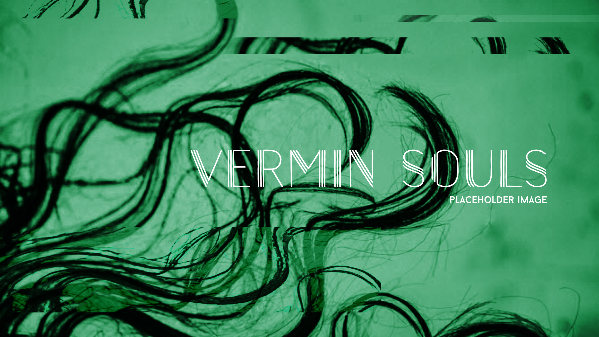

[](http://helve.live)

<a name="intro"></a>
> "Understanding does not cure evil, but it is a definite help, inasmuch as one can cope with a comprehensible darkness."
> Carl Jung

Ever looked in the mirror and thought the other side is more real? Ever thought the entity on the other side is in its correct spot and has more reason to live? Ever truly met yourself at the place where light and dark converge? You are the double on the other end of the mirror.

As you progress through memory sequences - your past becomes a fog within you.
All the light you see if from the past.


Description.


Description.


# Notes

Project parameters

Time: 10min loop

Video art based on our darkest desires and vices. Shadowself exposed. The feeling that the little person inside me is shattered into pieces. Darkest self is usually hard to piece together. Fueled by emotion, passion and despair. Shattered double?

Close-up: Slow zoom out shot of hair floating in a glass water container, creating ripples. Lit up from below with green. 

Close-up to Wide: Zoom out reveals a naked girl floating on water. 

Close-up Glitch Shot: She suddenly opens her eyes (closeup).

Medium Topshot: She curls and stands up in the water and leaves the container.

Telelens Shot: Then she stands motionless in an empty dark room. Light reflecting of her wet face. Drips slowly coming down on a dusty floor.

Something fills the air in the dark warehouse room - an entity. Girl seems to be unaffected by its presence. Completely calm. Accepting.

'Inject' she whispers.

Glitch title: PHASE A: INITIATED.

Slowmo Downshot: She drops to the floor, dust comes up.

7 people wearing black clothes and masks enter the room and surround the body.

Wide shot, they start to tighten the circle.
Top shot, they continue to tighten the circle. Raising muffled sound.
Cut away to closeup so we don't see the whole room.
Wide shot, blacked people are suddenly rats that start wandering around the warehouse room.

Title: PHASE B: INITIATED

### Table of Contents
1. [Introduction.](#intro)
2. [Features.](#features)
3. [Issues.](#issues)
4. [Icebox.](#icebox)
5. [Installation and usage guide.](#install)
6. [Contributing.](#contribute)
7. [License.](#license)
8. [Credits.](#credits)
9. [Commit Glyphs.](#glyphs)

<a name="features"></a>
### Features
+ Feature_01
+ Feature_02
+ Feature_03

<a name="issues"></a>
### Issues
+ Visual Design
+ Narrative Meaning
+ Glitch Research

<a name="icebox"></a>
### Icebox
+ Shotlist
+ Storyboard
+ Idea_03

<a name="install"></a>
### Installation and Usage Guide
Include basic necessary components. Gifs if required.
```
1. 
2. 
3. 
```

<a name="contribute"></a>
### Contributing
Insert project contribution rules if allowed.

<a name="license"></a>
### License
Insert project licensing options if there are any.

<a name="credits"></a>
### Credits
Insert project creator entities, contributors and their respective presence links.

<a name="glyphs"></a>
### Commit Glyphs

+ ☰ Code structure and formatting
+ ▲ Performance improvements
+ ⨯ File deletion
+ ∗ Bugfix
+ ⬡ New Feature
+ ⎔ Documentation
+ ❑ UI design
+ ⚑ Release
